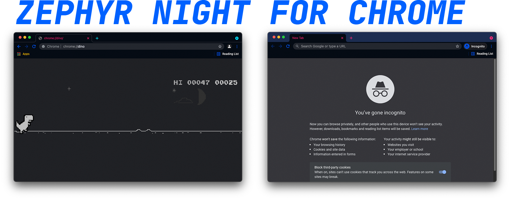

A theme for chromium based browsers. 

## Installation
Turn on developer mode for your browser. Go to `chrome://extensions` in your address bar and drag the `.crx` file into the window to install the theme.

## More
* If you like this theme, check out my matching theme for VSCode: [Zephyr Night for VSCode](https://github.com/kaischuygon/ZephyrNight_VSCode)
* Have Firefox? I made a theme for that too! [Zephyr Night for Firefox](https://addons.mozilla.org/en-US/firefox/addon/zephyr-night/)
