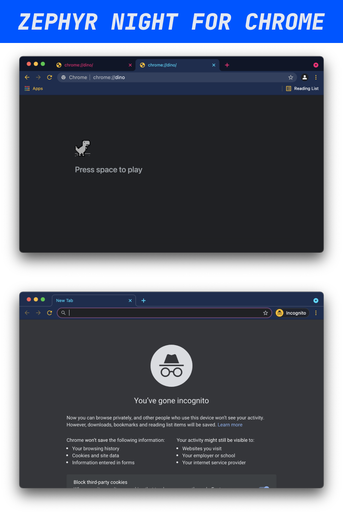

A theme for chromium based browsers. 

## Installation
Turn on developer mode for your browser. Go to `chrome://extensions` in your address bar and drag the `.crx` file into the window to install the theme.

## More
* If you like this theme, check out my matching theme for VSCode: [Zephyr Night for VSCode](https://github.com/kaischuygon/ZephyrNight_VSCode)
* Have Firefox? I made a theme for that too! [Zephyr Night for Firefox](https://color.firefox.com/?theme=XQAAAAJyAQAAAAAAAABBKYhm849SCia73laEGccwS-xMDPrxiv6G_P3DQOJFjzza9aH0u2YYSTYT7qAKYKku50B0Z1tl38bYMc7bmhEWyBMxHZLksH1ZHT8Dy-EJ-tbKfI2EHd1E2q9EWDlD5_nIiVGMRiyObQzJT2z-HqkN-qjaglXeeyP2EgytnmlvoUv1O9wt0LmYFnksuP_BnQ9j5X5twHMjMEidfCGPd98AAxxf5F-oTTAXoWYuP3msx6ODQ-mx56W1NJ_g8Ua4_LMfTWSwY7sxp7XPIC_0vmASgrUXPrX_7HSugA)
